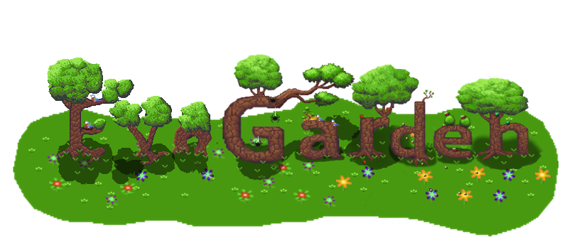

## A Predator-Prey Simulation

[](https://github.com/cristianglezm/EvoGarden/actions/workflows/ci.yml) [](https://github.com/cristianglezm/EvoGarden/actions/workflows/cd.yml)

> [!NOTE]
> This project was created as an experiment with Google's Gemini 2.5 to explore what the LLM would build by giving it the documentation of [@cristianglezm/flower-evolver-wasm](https://github.com/cristianglezm/FlowerEvolver-WASM) (a npm package).
> 
> it made an emoji ecosystem where flowers evolve and survive, insects reproduce and pollinate the flowers, birds hunt insects not protected by the flowers.

A dynamic garden simulation where flowers evolve under the pressure of insects and birds. Watch a Darwinian battlefield unfold as flowers, insects, and birds interact in a delicate ecosystem, with visual traits driven by the NEAT algorithm.

## ✨ Features

-   **Dynamic Weather & Seasons**: Experience a living environment with four distinct seasons (Spring, Summer, Autumn, Winter) that cyclically affect temperature and humidity. Be prepared for unpredictable weather events like heatwaves, cold snaps, heavy rain, and droughts that create new evolutionary pressures.
-   **Intelligent Insects with Genetic AI**: Insects no longer move randomly. Each insect has a unique genetic code (genome) that determines its preferences for different flower traits. They actively seek out flowers that best match their genes, creating complex and emergent behaviors.
-   **Complex Social Insects & Warfare (Honeybees)**: Introducing Honeybees (`🐝`), Hives (`🛖`), and a dynamic territory system. Bees work together to gather pollen and produce honey. But they are also territorial; when bees from rival hives meet, they fight. They can leave `UNDER_ATTACK` signals on their territory marks, which propagate through the network to call for backup, creating emergent hive-vs-hive battles.
-   **Intelligent Ant Colonies & Warfare (`🐜`, `⛰️`)**: Ants establish colonies and work together as efficient scavengers, leaving decaying pheromone trails for other ants to follow to food. They are also territorial and will attack ants from rival colonies on sight, leaving warning signals on their trails to alert their nestmates to danger.
-   **Insect Evolution**: When insects reproduce, their offspring inherit a mix of their parents' genomes, with a chance for random mutation. This creates a dynamic evolutionary loop where insects adapt to the garden's flower population over generations.
-   **Stamina-Based Actions & Health**: Insects now manage health and stamina. Actions like moving and attacking cost stamina, and they must rest to recover. Their health slowly decays, and if it runs out, they die and decompose into a nutrient, completing the ecosystem's cycle of life.
-   **Corpse & Decay System**: When insects die of old age or from toxic flowers, they leave behind a corpse that slowly decays. Once fully decayed, the corpse transforms into a nutrient, completing another link in the ecosystem's cycle of life.
-   **Scavenger Pests (Cockroaches)**: When too many corpses pile up, cockroaches (`🪳`) emerge to clean the mess. They consume corpses and can even attack weak flowers, converting them into low-grade nutrients.
-   **Slow & Slimy Snails**: Introducing the Snail (`🐌`), a slow but sturdy herbivore that leaves behind a trail of slime, slowing down other insects that cross its path.
-   **High-Performance Canvas Rendering**: The entire simulation grid is rendered on a single `<canvas>` element, ensuring smooth performance even with hundreds of entities.
-   **User Goals & Scenarios (Challenges)**: Engage with a set of predefined challenges that track your progress across multiple playthroughs. Challenges cover survival (e.g., *Ancient Bloom*), predation (*Apex Predator*), ecosystem balance (*Circle of Life*), population milestones (*The Swarm*), and genetic evolution (*Poison Garden*).
-   **Seed Bank**: Automatically saves the genomes of "champion" flowers—the longest-lived, most toxic, and most healing—to a persistent database. These champions are then used to repopulate the garden after a collapse, ensuring genetic resilience. Users can view these champions, download their genomes, or clear the bank to start fresh.
-   **Data Visualization & Analytics**: Monitor the health and evolution of your garden over time with dynamic, real-time charts. Track population dynamics (including specialized counts for **toxic** and **healing** flowers), key ecosystem events, the average expression of genetic traits, application performance, and a new Environment chart that visualizes the history of temperature and humidity changes.
-   **Advanced Notification System & Status Display**:
    -   **Centralized Header**: A retro, terminal-style header provides a non-intrusive feed of all simulation events, complemented by a real-time display of the current season, temperature, humidity, and any active weather events.
    -   **Detailed Event Review**: Click the header log to open a full-screen, scrollable panel with the complete event history.
    -   **Configurable Notifications**: Take control of the UI with three notification modes: log only, important toasts, or all toasts.
-   **Real-time Actor Tracking & Global Search**: Track any actor in real-time. Use the global search in the header to find an actor by its ID, highlight it on the grid, and then track it. The search is powered by a Trie data structure for instant, prefix-based matching. Alternatively, start tracking any actor with a single click from its details panel. The header control intelligently transforms to a "Stop Tracking" button for easy access.
-   **Real-time Performance Insights**: A status indicator in the header shows the number of pending genetics tasks, giving users a live look at the simulation's computational load.
-   **Polished & Refined UI**: The interface is designed for clarity and ease of use, featuring collapsible control panels, a clean status header, and subtle visual cues like inset shadows on scrollable content to improve usability.
-   **Dynamic Insect Lifecycle**: Insects reproduce by laying eggs, which have a gestation period to hatch. Some insects, like the butterfly, have a full metamorphosis cycle including a caterpillar and cocoon stage, creating a more complex and realistic population model.
-   **Layered Actor System**: Actors like insects and birds can occupy the same grid cell as flowers, allowing for more realistic interactions.
-   **Simulation State Persistence**: Save your garden's state to your browser's local storage and load it back in a future session.
-   **Collapsible UI**: The controls and data panels are slide-out sidebars, keeping the main view clean and focused on the simulation.
-   **Procedural 2D Flowers**: Each flower's appearance is determined by its unique genome, procedurally generated by [@cristianglezm/flower-evolver-wasm](https://github.com/cristianglezm/FlowerEvolver-WASM) and rendered in real-time.
-   **Configurable Flower Detail**: Adjust the radius of flowers (from 4 to 64) to balance visual complexity with performance.
-   **Genome & Environment-Driven Stats**: A flower's core statistics are all calculated from its genome in response to the current environmental conditions, meaning traits that improve survival can be naturally selected.
-   **Dynamic Ecosystem**: An interactive simulation of flowers, pollinating insects, and predatory birds whose actions directly impact the environment.
-   **Automated Ecosystem Balancing**: The simulation engine dynamically spawns predators (birds) or apex predators (eagles) in response to insect population booms and busts. An herbicide plane is also automatically deployed when flower density becomes too high.
-   **WASM-Powered Genetics**: A high-performance WebAssembly module handles complex genetic operations.
-   **Interactive Simulation**: Control world parameters like climate and population, pause/play the world, and reset with new initial conditions.
-   **Inspect Individuals**: Click on any cell to inspect its occupants. A selection panel appears if multiple actors are present. View detailed, real-time stats for any actor and start tracking them directly from their dedicated details panel.
-   **Interactive 3D Flower Viewer**: Generate and view a 3D model of any flower from its genome in an interactive modal viewer.

## 🔬 Key Concepts

EvoGarden is more than just a visual simulation; it's a complex, self-regulating digital ecosystem. Understanding these core concepts will enhance your experience:

1.  **The Circle of Life**: The entire ecosystem is a closed loop. Birds eat insects, creating nutrient-rich droppings. Insects also die of old age, leaving corpses that decompose into nutrients. These nutrients are then absorbed by flowers, which heal and grow stronger. Healthy flowers can then support a larger insect population, which in turn supports the birds, completing the cycle.

2.  **Dual Genetic AI**: Evolution is at the heart of EvoGarden.
    *   **Flowers**: Their visual appearance, health, stamina, toxicity, and resilience to weather are all determined by a unique genetic code.
    *   **Insects**: They also possess a genome that dictates their preferences for certain flower traits. They actively seek out flowers that best match their genes, creating an evolutionary arms race between predator and prey.

3.  **Environmental Pressure**: The garden is a dynamic environment. The four seasons bring cyclical changes in temperature and humidity, while random weather events like heatwaves and cold snaps introduce sudden challenges. Flowers and insects that evolve to be resilient to these changes will have a significant survival advantage.

4.  **Ecosystem Balance**: The simulation actively works to prevent ecological collapse. If the insect population booms, the engine will spawn predatory birds. If the insect population crashes (leaving birds with no food), an apex predator (the eagle) may be introduced to cull the bird population. If flowers grow too dense, an herbicide plane is deployed. This creates a constantly shifting balance of power.

5.  **Diverse Permitted Actors**: The simulation allows for a diverse range of creatures, which can be enabled or disabled from the controls panel. The default ecosystem includes:
    *   **Birds**: Bird (`🐦`), Eagle (`🦅`).
    *   **Insects**: Butterfly (`🦋`), Caterpillar (`🐛`), Snail (`🐌`), Ladybug (`🐞`), Beetle (`🪲`), Scorpion (`🦂`), Honeybee (`🐝`), Ant (`🐜`), Spider (`🕷️`), Cockroach (`🪳`).

## 🔬 Simulation Deep Dive

### Performance & Architecture
-   **Dual-Worker Architecture**: The application uses two separate Web Workers (one for the main simulation loop, one for expensive WASM genetics calls) to achieve a completely non-blocking simulation.
-   **Asynchronous Flower Creation**: New flowers are generated in the background without pausing the simulation. This is managed by an **`AsyncFlowerFactory`** which communicates with the genetics worker. A lightweight `FlowerSeed` placeholder is used until the full flower is ready.
-   **Delta-Based State Updates**: The simulation worker sends only a small list of changes ("deltas") to the UI each tick, minimizing data transfer and ensuring a fluid experience.
-   **Layered Canvas & Change Detection**: The simulation is rendered across two stacked canvas layers (a static background for flowers/grid, a dynamic foreground for mobile actors) to eliminate the bottleneck of re-drawing hundreds of complex SVGs every frame.
-   **Multi-Quadtree Optimization**: The simulation uses multiple Quadtree data structures each tick for high-performance spatial querying, avoiding slow, full-grid scans.
-   **Trie-based Actor Search**: A Trie data structure is used for the global actor search, providing instant, prefix-based ID matching even with hundreds of actors on the grid.

### Dynamic Environment
The garden is no longer static. It features a fully dynamic climate system that directly impacts the survival and evolution of its inhabitants.
-   **Seasons**: The simulation progresses through four distinct seasons (Spring, Summer, Autumn, Winter) on a configurable cycle. Each season has a different base temperature and humidity, creating long-term environmental pressures.
-   **Weather Events**: To add unpredictability, there is a small chance each tick for a random weather event to occur. These events, such as **heatwaves**, **cold snaps**, **heavy rain**, and **droughts**, temporarily override the seasonal norms and can drastically alter the ecosystem's balance.
-   **Spring Renewal**: To prevent total extinction and allow for recovery, the simulation has a built-in renewal mechanism. When winter ends and spring begins, if either the flower or insect populations have been wiped out, a small number of new, random actors are introduced to the garden.

### Actors & Behaviours
-   **Flowers**: The foundation of the ecosystem. Their appearance and base stats are dictated by their genome's response to the environment.
    -   **Environmental Stress**: Flowers are now directly affected by the climate. If the `currentTemperature` is outside their genetically-determined optimal range, their stamina is consumed **twice as fast**, rewarding flowers that evolve to be resilient to the local climate.
    -   **Toxicity & Healing**: Flowers have a genetically determined `toxicityRate`. If this rate is negative, the flower **heals** visiting insects, extending their lifespan. If it's above a certain positive threshold, it becomes **carnivorous**, damaging any insect that lands on it. This creates a powerful evolutionary trade-off between attracting pollinators and self-defense.
    -   **Lifecycle**: They consume stamina, then health. They heal by absorbing nutrients. If their health reaches zero, they wither.
    -   **Reproduction**: Mature flowers can reproduce in three ways: Proximity Pollination, Insect Pollination, and Wind Pollination.
-   **Insects** (General):
    -   **Genetic AI & Movement**: Insects use a Quadtree to find nearby flowers and then use their unique **genome** to calculate a "desirability score" for each one. This intelligent targeting leads them to flowers that best suit their evolved preferences, rather than just the closest one.
    -   **Lifecycle & Stamina**: All insects have `health` that slowly depletes, and a `stamina` bar that is consumed by actions like moving and attacking. They must rest to regenerate stamina. If an insect's health reaches zero, it dies and leaves behind a `Corpse` which will eventually decompose into a nutrient.
    -   **Dormancy**: Insects are sensitive to cold. If the `currentTemperature` drops below a certain threshold, they become dormant, ceasing all activity and halting their aging process until the weather warms up.
    -   **Interaction**: They are affected by a flower's toxicity. They will be damaged *by* carnivorous flowers or be healed by healing flowers. They carry pollen to other flowers to trigger reproduction.
    -   **Reproduction & Evolution**: Two insects of the same species on the same cell may lay an egg. The offspring inherits a combination of its parents' genomes, with a small chance for mutation, allowing the insect population to evolve over time.
-   **Specialized Insects**:
    -   **Butterflies & Caterpillars (`🦋`, `🐛`)**: This pair demonstrates a full metamorphosis lifecycle.
        -   **Butterfly**: A pure pollinator that causes no damage to flowers. When it reproduces, it lays an egg that hatches into a Caterpillar.
        -   **Caterpillar**: A voracious flower eater. After consuming a set amount of flower health, it transforms into a stationary `Cocoon` (`⚪️`).
        -   **Cocoon**: After a gestation period, the cocoon hatches into a new Butterfly, completing the cycle.
    -   **Ladybugs (`🐞`)**: A specialized predator that helps control the caterpillar population.
        -   **Hunter AI**: Ladybugs actively hunt for Caterpillars (`🐛`).
        -   **Pest Control**: When a Ladybug eats a Caterpillar, it removes the pest and gains a significant health and stamina boost.
        -   **Patrolling**: If no Caterpillars are present, Ladybugs will patrol between flowers, acting as secondary pollinators without damaging them.
    -   **Beetles (`🪲`)**: A "support" class insect that maintains the health of the garden.
        -   **Medic AI**: Beetles seek out healthy flowers to collect an abstract nutrient resource.
        -   **Healing**: After collecting, they search for weak or damaged flowers and deposit the resource, healing them.
    -   **Snails (`🐌`)**: A "tank" class insect.
        -   **Slow Movement**: Snails operate on a move cooldown, making them the slowest insects in the garden.
        -   **Slime Trails**: When a snail moves, it leaves behind a temporary `SlimeTrail` (`💧`). This trail slows down any other insect that moves onto its cell, creating a unique environmental hazard.
        -   **Sturdy**: They are sturdy herbivores that eat flowers like default insects but can take more damage.
    -   **Scorpions (`🦂`)**: A deadly ground predator that specializes in hunting other tough insects. Scorpions have a prey preference, prioritizing beetles (`🪲`), then snails (`🐌`), cockroaches (`🪳`), and finally ladybugs (`🐞`). When a scorpion kills its prey, it leaves behind a corpse and receives a significant health and stamina boost.
    -   **Spiders (`🕷️`) & Spider Webs (`🕸️`)**: A "trapper" class predator that creates a network of webs to catch prey.
        -   **Web Building**: Spiders use a special "web stamina" to build a limited number of webs in strategic, high-traffic locations.
        -   **Trapping**: Webs have a chance to trap any non-flying insect that moves onto their cell. Stronger insects have a higher chance to break free, damaging the web in the process.
        -   **Ambush & Consumption**: The spider waits on its web network. When an insect is trapped, the spider moves to the location, consumes the prey to restore its own health and stamina, and resets the trap.
    -   **Honeybees (`🐝`), Hives (`🛖`), & Territory (`📍`)**: A complex social insect system.
        -   **Honeybees**: Gather pollen from flowers and return it to their home `Hive`. Each bee is loyal to its hive.
        -   **Hives**: A central colony that converts collected pollen into honey. When honey reserves are high, the hive spawns new bees. Hives are distributed across the map based on a configurable grid area.
        -   **Territory Marks & Communication**: As bees travel, they leave invisible territory marks that serve as a sophisticated communication network.
        -   **Territorial Warfare**: The garden is a battlefield. When bees from rival hives cross paths, or when a bee moves onto and claims a territory mark left by a rival, it triggers a 'hunting' state. Bees will attack rivals on sight. Critically, they can leave an `UNDER_ATTACK` signal on their territory marks. This signal propagates through adjacent friendly marks like a wildfire, creating a scent-based alarm system that can rally nearby bees from the same hive to join the fight.
    -   **Ants (`🐜`), Ant Colonies (`⛰️`), & Pheromone Trails**: A complex system for ground-based scavenging and resource gathering.
        -   **Ants**: Foragers that operate on a state machine. They start by `seeking_food`. If they find a strong pheromone trail left by another ant, they will follow it. Otherwise, they search for food, prioritizing high-value items like corpses, eggs, and cocoons. Once an ant picks up food, it switches to a `returning_to_colony` state.
        -   **Ant Colonies**: Stationary bases that store food and spawn new ants. When an ant returns with food, the colony's `foodReserves` increase. When reserves are high, new ants are spawned.
        -   **Pheromone Trails**: Invisible trails left by ants that are returning to the colony *with food*. The `strength` of the trail is proportional to the value of the food being carried. These trails decay over time, and other ants will follow the strongest available trail, creating efficient, emergent paths to food sources.
        -   **Colony Conflict**: Ants are also fiercely territorial. When ants from different colonies meet, they will immediately fight. An ant engaging a rival can leave an `UNDER_ATTACK` signal on its pheromone trail. While this signal doesn't propagate like the bees' advanced system, it serves as a localized warning to other ants from the same colony that follow the trail, potentially drawing them into the conflict and creating skirmishes over resources.
-   **Cockroaches** (`🪳`): A pest and scavenger species. They are dynamically spawned by the `PopulationManager` when the number of corpses on the grid becomes too high. They hunt for corpses to eat, restoring their health and stamina. If no corpses are available, they will attack weak flowers.
-   **Eggs** (`🥚`): The offspring of insects. They remain stationary and hatch after a fixed timer, unless eaten by a bird.
-   **Birds** (`🐦`): The predators of the garden.
    -   **AI & Movement**: Birds use a Quadtree to efficiently scan for prey. They prioritize hunting unprotected insects, then defenseless cocoons, and finally stationary eggs. When not hunting, they exhibit a smarter patrolling AI, flying towards flowers to search for prey.
    -   **Prey Protection**: Birds cannot see or prey on an insect while it is resting on the same cell as a flower, making flowers a safe haven.
    -   **Nutrient Cycle**: After killing an insect, the bird leaves behind a nutrient-rich dropping. Eating a cocoon also produces a small nutrient.
-   **Eagles** (`🦅`): Apex predators introduced dynamically to maintain ecological balance by culling the bird population when insects become scarce.
-   **Herbicide Plane** (`✈️`) & **Smoke** (`💨`): A regulatory mechanism to prevent flower overgrowth. The plane flies in a straight line, leaving a trail of temporary, damaging smoke clouds that expand to create a wider path of effect.

### Nutrients & The Ecosystem Loop
Nutrients (`💩`) are the simulation's core resource, created from predated insects, insects that die of old age and leave a corpse that decays, or random bird droppings. They provide an area-of-effect heal to all flowers in a 3x3 area before being consumed. This creates a dynamic resource cycle: predators consume prey -> deaths create nutrients -> nutrients heal flowers -> healthy flowers support more prey -> more prey supports more predators.

### Ecosystem Balance & Dynamic Population Control
The garden is a self-regulating system. A dedicated **`PopulationManager`** actively monitors population trends to prevent ecological collapse.
-   **Insect Booms**: If the insect population grows too rapidly, the manager will dynamically spawn a new **bird**.
-   **Insect Crashes & Apex Predators**: If the insect population begins to crash, the manager intervenes by spawning an **eagle** to hunt a single bird.

## 🧬 The Genetics Engine: `@cristianglezm/flower-evolver-wasm`

The visual variety and evolutionary mechanics are powered by a custom WebAssembly module. This service is responsible for creating and manipulating the genetic code of the flowers and rendering them as SVGs or 3D models.

**Important Note**: This service only handles the *genetic and visual* aspects of a flower. It does not track in-simulation state like `health`, `stamina`, or `age`. That state is managed entirely within the `SimulationEngine`.

### Core Functions:
-   `async makeFlower(): Flower`: Creates a new flower with a completely random genome.
-   `async reproduce(father: string, mother: string): Flower`: Combines the genomes of two parent flowers.
-   `async mutate(original: string, ...rates): Flower`: Applies random mutations to an existing genome.
-   `async getFlowerStats(genome: string, ...envFactors): FlowerGenomeStats`: **Core mechanic.** Takes a genome and environmental conditions (humidity, temperature) and returns the flower's base statistics.
-   `setParams(params: FEParams)`: Configures the rendering parameters.
-   `async draw3DFlower(genome: string): string`: Takes a flower's genome and returns a string containing a GLTF file for 3D rendering.

## 📁 Project Structure
-   `index.html`: The single-page entry point.
-   `package.json`: Defines project metadata, scripts (`dev`, `build`), and dependencies.
-   `vite.config.ts`, `tailwind.config.js`, `postcss.config.js`: Configuration files for the Vite build tool and the Tailwind CSS styling pipeline.
-   `src/`: Contains all the application source code.
    -   `src/index.tsx`: The main entry point for the React application.
    -   `src/App.tsx`: The root React component. Manages global state and layout.
    -   `src/hooks/useSimulation.ts`: **Simulation Manager.** A custom hook that acts as a bridge to the simulation's Web Worker, managing its lifecycle and communication.
    -   `src/hooks/useActorTracker.ts`: **Actor Tracking.** A custom hook that contains the logic for selecting and following a specific actor in real-time.
    -   `src/simulation.worker.ts`: **Simulation Host.** This Web Worker runs on a separate thread and acts as a message broker between the main UI thread and the simulation logic. It's primary role is to host the `SimulationEngine` to prevent the UI from freezing during heavy calculations.
    -   `src/flower.worker.ts`: **Genetics Worker.** A dedicated worker that handles all expensive, asynchronous calls to the WASM genetics module, ensuring the simulation worker is never blocked.
    -   `src/lib/simulationEngine.ts`: **Simulation Orchestrator.** This class acts as a high-level orchestrator for the simulation's main loop, delegating tasks to specialized managers.
    -   `src/lib/PopulationManager.ts`: **Ecosystem Balancing.** This class encapsulates all logic related to population control. It tracks population histories, manages cooldowns, and decides when to introduce new birds, eagles, or herbicide planes.
    -   `src/lib/AsyncFlowerFactory.ts`: **Asynchronous Genetics.** Manages all communication with the `flower.worker.ts`, handling the creation of new flowers without blocking the simulation.
    -   `src/lib/EcosystemManager.ts`: A module that contains functions for system-wide behaviors like nutrient healing and **insect reproduction**, which includes genetic crossover and mutation logic for offspring.
    -   `src/lib/behaviors/`: Contains individual behavior modules for each actor type (`birdBehavior`, `insectBehavior`, `slimeTrailBehavior`, etc.). These modules are called by the `SimulationEngine` to process each actor's logic for a given tick, promoting a clean separation of concerns.
    -   `src/lib/behaviors/antColonyBehavior.ts`: The behavior for Ant Colonies.
    -   `src/lib/behaviors/pheromoneTrailBehavior.ts`: The behavior for Pheromone Trails.
    -   `src/lib/behaviors/spiderWebBehavior.ts`: The behavior for Spider Webs.
    -   `src/lib/behaviors/specialized/AntBehavior.ts`: The specialized behavior for Ants.
    -   `src/lib/behaviors/specialized/SpiderBehavior.ts`: The specialized behavior for Spiders.
    -   `src/lib/renderingEngine.ts`: A dedicated class for managing the two-canvas rendering system, including change detection and drawing logic.
    -   `src/lib/Quadtree.ts`: A generic Quadtree data structure for efficient 2D spatial queries.
    -   `src/lib/Trie.ts`: A generic Trie data structure for efficient prefix-based string searching, used by the `GlobalSearch` component.
    -   `src/components/SimulationView.tsx`: Hosts the two stacked canvas elements and orchestrates the `RenderingEngine`.
    -   `src/components/Controls.tsx`: UI for changing simulation parameters.
    -   `src/components/ActorSelectionPanel.tsx`: A panel that appears when a user clicks a cell containing multiple actors.
    -   `src/components/FlowerDetailsPanel.tsx`: UI that displays the stats of the selected flower. It handles pausing the simulation when its "View in 3D" button is clicked and includes a button to initiate tracking.
    -   `src/components/InsectDetailsPanel.tsx`: UI that displays the stats of the selected insect.
    -   `src/components/EggDetailsPanel.tsx`: UI that displays info about a selected egg.
    -   `src/components/GenericActorDetailsPanel.tsx`: A fallback UI for displaying info about other actors.
    -   `src/components/Flower3DViewer.tsx`: A React-Three-Fiber component that renders the 3D flower model.
    -   `src/components/Modal.tsx`: A generic modal component.
    -   `src/components/DataPanel.tsx`: The main UI for the slide-out panel containing challenges, analytics, and the Seed Bank, with a tabbed interface.
    -   `src/components/ChallengesPanel.tsx`: Renders the list of challenges and their progress.
    -   `src/components/ChartsPanel.tsx`: The main container for the analytics tab that renders the individual chart components.
    -   `src/components/charts/`: A directory containing individual, specialized chart components (`PopulationChart`, `EnvironmentChart`, etc.), making the analytics section more modular.
    -   `src/components/Chart.tsx`: A reusable wrapper component for the `echarts-for-react` library.
    -   `src/components/SeedBankPanel.tsx`: Renders the champion flowers saved in the Seed Bank.
    -   `src/components/StatusPanel.tsx`: The main container in the header for status information, including the global search widget.
    -   `src/components/GlobalSearch.tsx`: The UI component for the global actor search and tracking widget located in the header.
    -   `src/components/Toast.tsx`: Renders a single toast notification.
    -   `src/components/ToastContainer.tsx`: Manages the on-screen layout and rendering of all active toasts.
    -   `src/services/flowerService.ts`: A TypeScript singleton wrapper for the WASM module.
    -   `src/stores/`: Contains all Zustand global state management stores.
    -   `src/utils.ts`: A module for shared utility functions.
    -   `src/constants.ts`: Global simulation constants.
    -   `src/types.ts`: Shared TypeScript types for the simulation.

## 🚀 Getting Started

Follow these instructions to get a copy of the project up and running on your local machine for development.

### Prerequisites

You need to have [Node.js](https://nodejs.org/) (version 18 or higher) and npm installed on your computer.

### Installation & Setup

1.  Clone the repository and install the required dependencies using npm:
    ```bash
    npm install
    ```

### Running Locally

2.  To start the local development server, run the following command:
    ```bash
    npm run dev
    ```
    This will start a server, and you can view the application by navigating to the URL provided in your terminal (usually `http://localhost:5173`).

## 🧪 Testing

This project uses [Vitest](https://vitest.dev/) for unit and component testing and [React Testing Library](https://testing-library.com/docs/react-testing-library/intro/) for rendering components in a test environment.

To run all tests once in the terminal, execute:
```bash
npm test
```

To run tests in interactive watch mode, which is useful during development:
```bash
npm run test:watch
```

For a more visual testing experience with a dedicated UI, run:
```bash
npm run test:ui
```

## 🧪 End-to-End Testing

This project uses [Playwright](https://playwright.dev/) for End-to-End (E2E) testing, which runs tests against a real browser to simulate user interactions.

To run all E2E tests, first make sure the development server is not running, and then execute:
```bash
npm run test:e2e
```

## 📦 Building for Production

To create a production-ready build of the application, run:
```bash
npm run build
```
This command will type-check the code and then bundle it into a `dist` directory.

## 🐛 Debugging with React DevTools

[React DevTools](https://github.com/facebook/react/tree/main/packages/react-devtools) is automatically configured to run alongside the development server for inspecting the React component hierarchy, state, and props. Simply start the development server to use it.

## 🚢 Deployment

This project includes a GitHub Actions workflow for continuous deployment to GitHub Pages. Any push to the `master` branch will automatically trigger a build and deployment.

## 📄 License

This project is licensed under the Apache License 2.0. See the [LICENSE.md](LICENSE.md) file for details.
